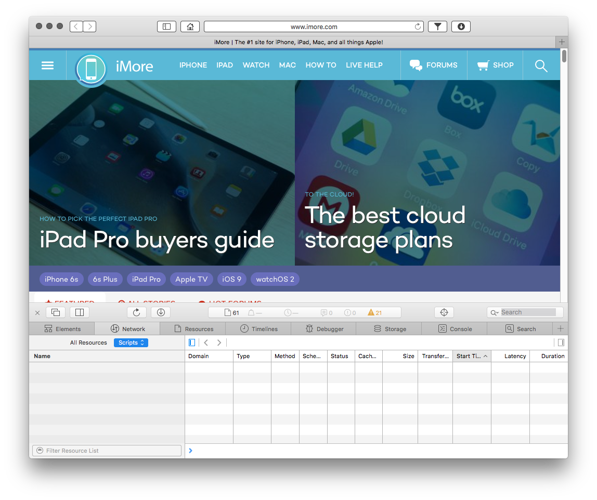
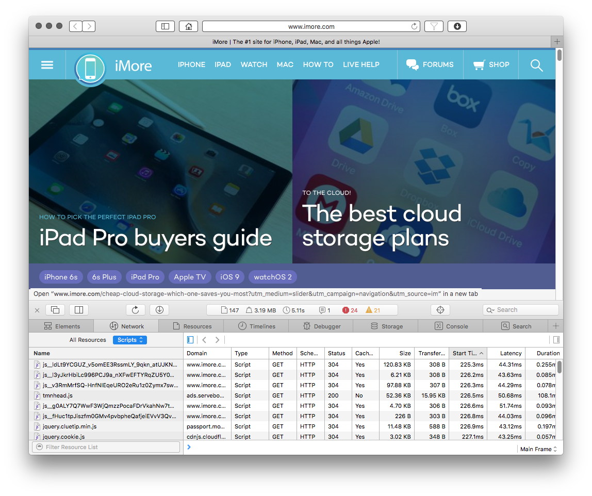

# Third-Party-Blocker.safariextension
A Safari Extension that blocks all third party scripts, but lets you add exceptions.

This extensions prevents all external scripts from loading, which means you only see the content of the current domain.
This stops external ads, external fonts and external videos from loading. It might break some pages in that case you can use the toolbar button to add an exception for this page.

## Filter Enabled

## Filter Disabled

